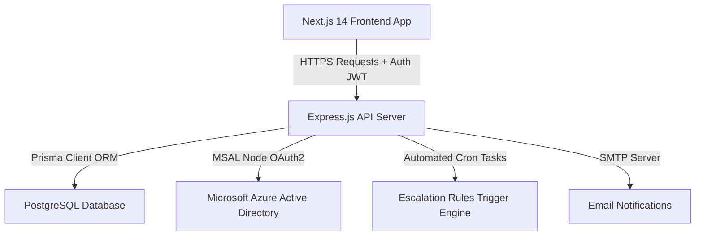

# 🎯 Atomberg Goal Setting & Performance Governance Portal

An enterprise-grade, high-impact **Goal Management & Performance Governance Portal** engineered for modern corporate organizations. Designed around a unified premium dark glassmorphism aesthetic, backed by a robust validation engine, real-time audit logging, and zero-reload asynchronous state synchronization.

---

## 🔗 Live Deployments

> [!IMPORTANT]
> Both services are fully active, deployed in production, and automatically synchronized.

* **🖥️ Live Web Application (Frontend):** [https://atomberg-goal-portal.vercel.app](https://atomberg-goal-portal.vercel.app)
* **⚙️ Production Backend API:** [https://atomberg-backend.onrender.com](https://atomberg-backend.onrender.com)
* **🏥 API Health Check:** [https://atomberg-backend.onrender.com/health](https://atomberg-backend.onrender.com/health)

---

## 👥 Seeded Corporate Testing Accounts

Use these pre-configured accounts to experience the full end-to-end performance evaluation lifecycle:

| User Role | Email Address | Password | Initial State / Testing Scenario |
| :--- | :--- | :--- | :--- |
| **👑 ADMIN** | `admin@atomberg.com` | `Admin@2026!` | Control active cycles, unlock goal sheets, warning logs, and view real-time audit trails. |
| **💼 MANAGER** | `manager@atomberg.com` | `Manager@2026!` | Manage pending team sheets, execute **Approve / Return for Rework** workflows, and log check-in feedback notes. |
| **🧑‍💻 EMPLOYEE (Approved)** | `ayushman@atomberg.com` | `Employee@2026!` | Goal Sheet status is **APPROVED**. Fully unlocked for quarterly achievements log. |
| **🧑‍💻 EMPLOYEE (Pending)** | `shreya@atomberg.com` | `Employee@2026!` | Goal Sheet status is **SUBMITTED** (Pending review). Awaiting manager sign-off to unlock check-ins. |

---

## 🏗️ System Architecture & Data Flow

---

## 🚀 Key Features

### ⚡ 1. Zero-Reload Reactive Synchronization
* **The Challenge:** Traditional dashboards often suffer from race conditions where auth variables (like email) load split-seconds after pages mount, showing blank states until manual refresh.
* **The Solution:** Fully synchronized backend auth responses containing user emails, coupled with reactive state hooks in React. The moment a user logs in, the portal instantly populates sidebar profiles, routes appropriate workspaces, and downloads specific user records **on the very first frame**.

### 🎨 2. Premium Dark Glassmorphic Design System
* **Harmonized Visual Identity:** Every page (Goals, Check-ins, Performance, Reports, Analytics, Escalation Settings, Logs, Audits) follows a strict, premium aesthetic:
  * Boxed, glowing gradient icon (`bg-indigo-500/10 rounded-xl border border-indigo-500/30`).
  * High-end purple-to-indigo linear gradient headers (`bg-gradient-to-r from-indigo-400 to-purple-400 bg-clip-text text-transparent`).
  * Subtle radial gradient overlays and modern dot-patterns (`.radial-bg` + `.bg-dot-pattern`) creating exceptional visual depth without UI clutter.
  * Brand Indigo focus glow outlines (`focus:ring-indigo-500/40`) and glowing borders for Microsoft SSO controls.

### 🎯 3. Dynamic Goal Validation Engine
* **Rigorous Guardrails:** Employee goal sheets are validated live within a premium two-column workspace:
  * Total weightage must equal **exactly 100%**.
  * Minimum weightage of **10%** per goal.
  * Maximum limit of **8 goals** per sheet.
* **Real-time Indicators:** Glowing status badges and dynamic validation tags update interactively as constraints are fulfilled.

### 📅 4. Unified System Timeline (FY2026-27)
* **Realistic Scenarios:** Database reference structures and Prisma seeding have been fully shifted to **FY2026-27** (spanning `2026-04-01` to `2027-03-31`), aligning perfectly with active real-world timelines.
* **Seeded Check-in Windows:** Quarter windows (Q1-Q4) are accurately mapped to late 2026 and early 2027. Notification cards dynamically query cycle data from the database rather than using hardcoded values.

### 🛡️ 5. Administrative Governance & Audit Controls
* **Audit Trail:** Timestamped ledger logs recording every critical action in the system (SSO Logins, Sheet Submissions, Approvals, Admin Unlocks).
* **Excel & CSV Export:** Download comprehensive goal sheets, dynamically formatted with alternating grid-color rows.
* **Escalation Triggers:** Automated warning cron tasks that track pending submittals and notify workers via active rules and toggle controls.

---

## 🛠️ Technology Stack

* **Frontend:** Next.js 14 (App Router), TypeScript, TailwindCSS, Lucide Icons, Framer Motion, Vanilla HSL CSS Tokens.
* **Backend:** Express.js, Node.js, TypeScript, Prisma ORM, Date-fns, ExcelJS.
* **Database:** PostgreSQL.
* **Security & SSO:** Microsoft MSAL Node (Azure Active Directory OAuth2).
* **Deployment:** Vercel (Frontend), Render (Backend).

---

## 🔒 Security & Roles Matrix

| Feature / Workspace | Employee | Manager | Admin |
| :--- | :---: | :---: | :---: |
| View & Set Personal Goals | ✅ | ✅ | ✅ |
| Log Quarterly Achievements | ✅ | ✅ | ✅ |
| Review Pending Sheets | ❌ | ✅ | ✅ |
| Approve / Reject Sheets | ❌ | ✅ | ✅ |
| Deploy Shared Departmental Goals | ❌ | ✅ | ✅ |
| Create & Toggle Escalation Triggers | ❌ | ❌ | ✅ |
| Administrative Goal Unlock | ❌ | ❌ | ✅ |
| Access Global System Audit Ledger | ❌ | ❌ | ✅ |
